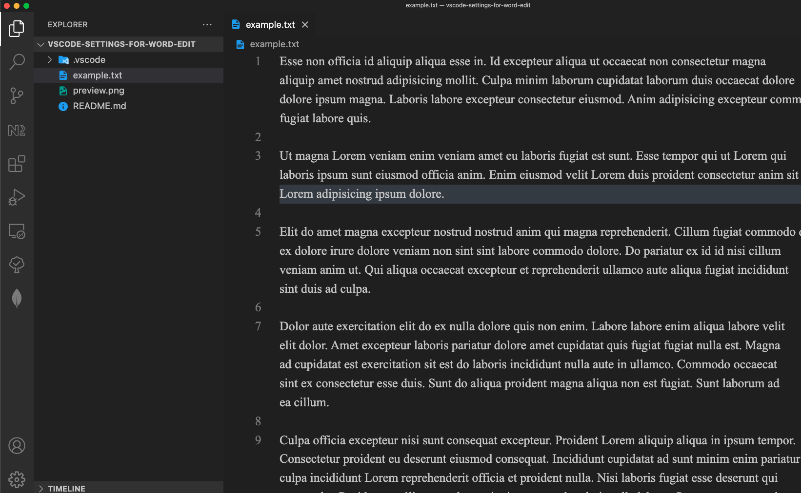

# vscode-settings-for-word-edit

<p align="center">
  
</p>

```json
{
  "editor.wordWrap": "on",
  "editor.fontFamily": "'Times New Roman'",
  "workbench.colorTheme": "FlatUI Dark",
  "editor.fontSize": 18,
}
```
